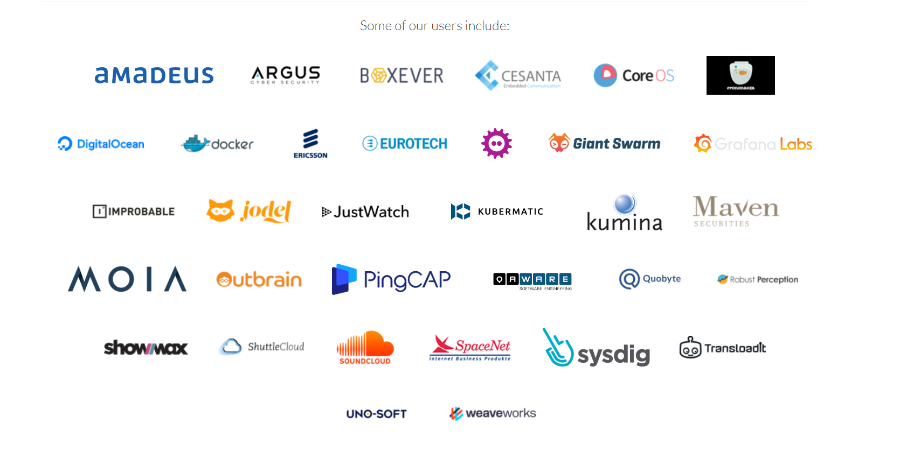

> 目前先放一个md里

# 监控业务的技术选型

## 为什么使用Prometheus作为主要监控系统

Prometheus是一款开源的监控和告警工具，其在云原生领域广泛应用。本项目选择使用Prometheus作为主要监控技术，是因为Prometheus具备以下优点：

- **多维度数据模型**：Prometheus采用多维度数据模型，可以通过标签对监控数据进行维度化的分类和聚合。这意味着在卫星性能监控系统中，可以方便地对卫星及其相关系统的各种性能指标进行监测，如CPU、内存、网络等，并对其进行分类和聚合分析，从而更好地理解卫星性能指标变化的趋势和规律。

- **数据采集灵活性**：Prometheus支持多种数据采集方式，如客户端主动推送数据、服务器端定时拉取数据等。这使得Prometheus可以适应各种应用场景，并方便用户进行扩展和集成。在卫星性能监控系统中，Prometheus可以通过数据采集代理程序进行卫星及其相关系统的监测数据采集，而代理程序则可以通过卫星系统中的传感器等设备来收集性能指标数据。

- **可视化和查询**：Prometheus提供了强大的查询语言和可视化工具，如PromQL和Grafana，可以对监测数据进行查询和可视化展示。这使得用户可以更加直观地理解卫星及其相关系统的性能数据变化，并对异常数据进行快速的诊断和分析。

- **生态系统丰富**：Prometheus拥有广泛的生态系统，包括Exporter、AlertManager、PushGateway等，这些工具能够进一步丰富Prometheus的功能，并提供更加全面的监控解决方案。在卫星性能监控系统中，这些工具可以用于实现数据采集、告警通知、数据持久化等功能。

综上所述，Prometheus具备多维度数据模型、数据采集灵活性、可视化和查询、生态系统丰富等优点，因此适合作为卫星性能监控系统的主要监控技术。

### 竞品对比
以下是一些其他监控系统与Prometheus的对比，以证明Prometheus作为卫星性能监控系统的主要监控技术的可行性：

1. **Zabbix VS Prometheus**：Zabbix是一款流行的监控工具，具有强大的告警和可视化功能。但与Prometheus相比，Zabbix在扩展性、数据模型、数据采集和性能等方面存在一些限制。例如，Zabbix需要手动配置监控项和主机，而Prometheus则可以自动发现和注册目标。此外，Prometheus的数据模型更加灵活，可以方便地进行标签分类和聚合分析，而Zabbix则需要在应用中手动设置数据模型。

2. **Nagios VS Prometheus**：Nagios是一款老牌的监控工具，具有可扩展性、可定制性和丰富的插件生态系统。但与Prometheus相比，Nagios在数据模型、数据采集和可视化方面存在一些限制。例如，Nagios无法进行多维度数据分类和聚合，而Prometheus则支持标签分类和聚合分析。此外，Prometheus具有强大的查询语言和可视化工具，而Nagios则需要手动编写插件和脚本实现数据的可视化和查询。

3. **InfluxDB VS Prometheus**：InfluxDB是一款专门用于时序数据的数据库，具有高吞吐量、高性能和高可用性。但与Prometheus相比，InfluxDB在可扩展性和数据模型方面存在一些限制。例如，InfluxDB需要手动创建索引和分区，并且无法支持多维度数据模型，而Prometheus则可以自动创建索引和分区，并且支持标签分类和聚合分析。

### 谁在用
#### 海外

#### 国内
国内大厂的云监控业务均采用普罗米修斯作为主要的监控系统

- 阿里云 - 云监控业务
- 字节火山引擎 - 云监控业务
- 百度智能云 - 监控业务
- 腾讯云 - 云监控业务

# 告警业务的选型

## 为什么使用AlertManager作为主要的告警系统

AlertManager是一个开源的告警路由和处理工具，它与Prometheus紧密集成，是Prometheus监控体系中的重要组成部分。以下是本项目选择AlertManager作为主要技术的一些原因：

1. **高度可靠的告警处理**：AlertManager具有高可用性和容错性，可以处理大量的告警和故障条件。它还提供了一些有用的特性，如静默期、抑制规则等，以减少无效或重复的告警。

2. **与Prometheus紧密集成**：AlertManager是Prometheus的默认告警处理工具，可以直接从Prometheus配置文件中引用。它还支持Prometheus的查询语言，可以轻松地编写复杂的告警规则。

综上所述，AlertManager是一款功能强大、高度可靠的告警处理工具，与Prometheus紧密集成，为本项目的告警业务提供了很多优势。通过AlertManager，我们可以灵活地管理和处理告警，快速地响应故障条件，提高系统的可靠性和可用性。

### 竞品对比

1. **PagerDuty** PagerDuty是一家领先的数字运营管理平台，提供了完整的事件管理、故障管理、协作和自动化工具。PagerDuty的告警路由和处理功能与AlertManager类似，也支持多种接收器（如SMS、电话、邮件、Slack等），并可以根据告警级别和标签进行路由。PagerDuty还提供了一些其他功能，如可视化事件状态、自定义通知、Escalation Policy等，使得它可以作为一个全面的数字运营管理平台来使用。相对于AlertManager，PagerDuty的优势在于其全面的事件管理和自动化功能，它可以帮助企业更好地响应故障和事件，减少故障的影响。但是，PagerDuty很贵，对于小型企业而言可能不太适合。

2. **Opsgenie** Opsgenie是一款基于云的响应平台，为企业提供了强大的告警路由和处理功能。Opsgenie支持多种接收器（如SMS、电话、邮件、Slack等），并可以根据告警级别和标签进行路由。Opsgenie还提供了一些其他功能，如灵活的告警规则、可视化报表、自动化任务等，使得它可以作为一个全面的告警处理平台来使用。相对于AlertManager，Opsgenie的优势在于其更加全面的告警规则和自动化功能，可以帮助企业更好地管理和处理告警。但是，Opsgenie的定价也比AlertManager高，可能不适合小型企业。

# 前端业务的技术选型
## 渲染框架 - Nuxt.js
Nuxt.js可以带给用户更好的体验，主要得益于其服务端渲染（SSR）的能力。与传统的客户端渲染（CSR）相比，服务端渲染可以提供更好的性能和用户体验。

具体来说，服务端渲染可以在服务器端将Vue.js组件渲染为HTML字符串并发送到客户端，从而提高页面的加载速度和响应速度，进而提升用户的体验感受。以下是Nuxt.js服务端渲染的几个优势：

1. **加载速度更快**：由于服务器端可以将页面渲染为HTML字符串并直接返回给客户端，因此可以减少页面的加载时间，提高用户的访问速度。

2. ~~**更好的SEO优化**~~：由于搜索引擎可以更好地处理服务端渲染的HTML，因此可以更好地优化网站的SEO效果。（内网应用不需要SEO）

3. **更好的用户体验**：由于服务器端可以直接渲染出页面内容并返回给客户端，因此可以提高用户的体验感受。

4. **更好的可维护性**：由于Nuxt.js提供了很多开箱即用的特性，例如自动生成路由、自动生成页面等，因此可以减少代码的冗余，提高代码的可维护性。

有研究表明，性能指标与用户体验之间存在着相关性。例如，页面加载速度可以影响用户的满意度和留存率，而页面的FCP（First Contentful Paint）指标则可以影响用户的粘性。FCP指标是指页面在浏览器中第一次渲染出任何内容的时间点，通常被认为是用户开始感知页面加载速度的时间点。

根据Google的研究，FCP小于100ms可以让用户认为页面瞬间加载，FCP小于1秒可以让用户感觉页面加载速度很快，FCP在3秒以上可以让用户感到页面加载速度很慢，并且会降低用户留存率。因此，提高页面的FCP可以有效提升用户的粘性和留存率。

此外，Nuxt.js还具有打包体积小的优势，可以通过webpack进行优化。减小打包体积可以提高网站的加载速度，从而提升用户的访问体验。

综上所述，采用Nuxt.js服务端渲染框架可以提高页面的FCP和加载速度，从而提升用户的体验感受和粘性。

TODO: 贴SSR&MPA和CSR&SPA的跑分图

TODO: 不知道Vite有没有对应的Bundle Analyzer，最好也贴个图

## 包管理工具 - pnpm
在项目中选择使用pnpm作为包管理工具相对于npm和yarn有以下优点：

1. **更快的安装速度**：与npm和yarn相比，pnpm的安装速度更快。因为pnpm使用一种类似于硬链接的方式来安装依赖项，它可以避免在不同项目之间重复安装相同的依赖项。

2. **更少的磁盘占用**：与npm和yarn相比，pnpm占用更少的磁盘空间。当多个项目使用相同的依赖项时，npm和yarn会在每个项目中安装依赖项，而pnpm只会在磁盘上存储一份依赖项。

3. **更好的兼容性**：pnpm支持npm和yarn的大部分特性，包括锁定依赖项版本、私有模块、NPM脚本和NPM配置文件等。

有关npm和yarn与pnpm之间的比较，有一些基准测试已经表明，pnpm的性能在某些情况下比npm和yarn更好。例如，pnpm的安装速度可以比npm和yarn快10倍以上。同时，pnpm在安装依赖项时可以减少磁盘使用量，并提供更快的本地缓存。这些特性使得pnpm在大型项目中更具可扩展性和可维护性。

~~## Monorepo - pnpm-workspace(虽然用了，但是好像没什么必要)~~
## JS框架 - Vue3

Vue3作为新的Vue主版本，相对于Vue2有以下优势：

1. **更好的性能**：Vue3通过重新设计Virtual DOM和响应式系统来提高性能。相较于Vue2，Vue3在渲染大型组件树时性能有了大幅度的提升，而且在打包大小上也做了优化，使得应用的首次加载时间更短。

2. **更好的可维护性**：Vue3引入了Composition API，使得组件的逻辑更容易复用和组合。这种新的API风格更加灵活，允许开发人员按照功能而不是类型组织代码，提高了代码的可读性和可维护性。

3. **更好的类型支持**：Vue3引入了TypeScript支持，允许开发人员在编写Vue应用时使用TypeScript的静态类型检查功能。这样可以更早地发现和修复类型相关的错误，提高代码的健壮性和可维护性。

4. **更好的工具链**：Vue3针对开发过程中的痛点做了一系列的优化，比如对单文件组件进行了改进，使得编写和调试更加便捷。同时，Vue3提供了一些新的工具，如Vite等，以提高开发效率。

综上所述，Vue3相较于Vue2、jQuery和纯JS具有更好的性能、更好的可维护性、更好的类型支持和更好的工具链。因此，在开发大型前端应用时，选择Vue3作为主要技术栈可以提高应用的开发效率和用户体验。
## 数据可视化 - AntV

相对于传统的Canvas图表开发，AntV具有以下优越性：

1. **简单易用**：使用AntV可以轻松地创建各种图表，而且不需要手动处理Canvas的绘图过程。AntV提供了丰富的API和配置选项，可以快速创建出漂亮的图表效果。

2. **高度可定制**：AntV提供了很多可自定义的选项，如图表的样式、动画效果、交互方式等。而且，AntV可以通过自定义主题、组件等方式进行更深层次的定制。

3. **兼容性好**：AntV支持在各种主流浏览器、移动端设备、React、Vue等前端框架中使用，而且能够自适应不同的屏幕尺寸和设备类型。

4. **强大的数据处理能力**：AntV提供了多种数据格式的支持，如数组、JSON、CSV等。同时，AntV还提供了多种数据处理的API和功能，如数据过滤、数据映射等，能够快速处理海量数据。

5. **大量实用的扩展插件**：AntV提供了很多实用的扩展插件，如地图插件、时间线插件等。这些插件可以快速实现一些复杂的图表效果。

综上所述，相较于传统的Canvas图表开发，AntV具有更高的开发效率和更丰富的功能，能够满足各种图表需求，并且在可定制性、兼容性、数据处理能力等方面有很大优势。因此，在大型前端项目中使用AntV作为图表库，可以快速实现各种图表效果，提高应用的用户体验。